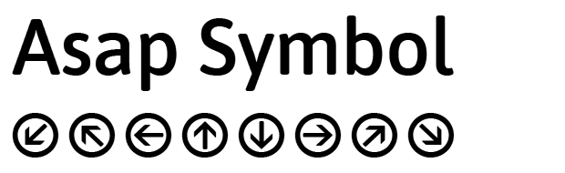

Asap Symbol Info

Readme

# Asap Symbol  
###(*First Release*)

**Omnibus-Type**  
*SIL Open Font License, 1.1*

Asap Symbol is being developed from Asap Typeface (Regular, Italic, Bold and Bold Italic). This new font is still under development. 

Previously Asap Typeface was designed to be used simultaneously in print and digital platforms. The technical and aesthetic characteristics of the font are both crafted for high performance typography.

Asap is a *contemporary sans-serif family with subtle rounded corners* typeface family from [Omnibus Type](http://omnibus-type.com/). This family, specially developed for screen and desktop use, offers a standarised character width on all styles, which means lines of text remain the same length. This useful feature allows users to change type styles on-the-go without reflowing a text body. .

**Features support**
- `completar`

To contribute to the project contact [Omnibus Type](http://www.omnibus-type.com/).

### Design

* **Asap Symbol** Tania Quindós (original design); Elena González Miranda, Marcela Romero and Pablo Cosgaya (design); Pablo Cosgaya (production); Nicolás Silva (programming).

### License

Copyright (c) 2014, Omnibus-Type (www.omnibus-type.com omnibus.type@gmail.com) with Reserved Font Name 'Asap Symbol'

Licensed under the [*SIL Open Font License, 1.1*](http://scripts.sil.org/OFL); you may not use this file except in compliance with the License.

======