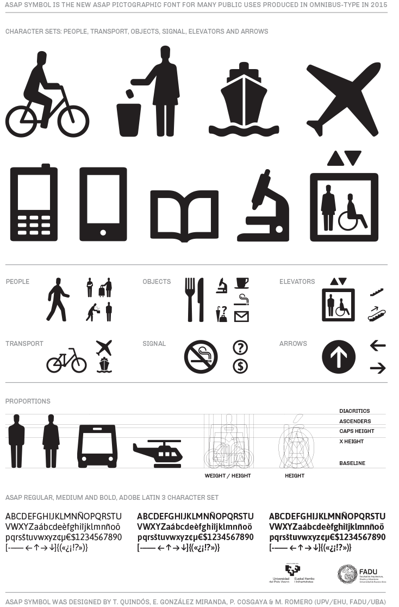

# Asap Symbol  
###(*Release Candidate*)

**Omnibus-Type**  
*SIL Open Font License, 1.1*

Asap Symbol is being developed from Asap Typeface (Regular, Italic, Bold and Bold Italic). This new font is still under development. 

Previously Asap Typeface was designed to be used simultaneously in print and digital platforms. The technical and aesthetic characteristics of the font are both crafted for high performance typography.

Asap is a *contemporary sans-serif family with subtle rounded corners* typeface family from [Omnibus Type](http://omnibus-type.com/). This family, specially developed for screen and desktop use, offers a standarised character width on all styles, which means lines of text remain the same length. This useful feature allows users to change type styles on-the-go without reflowing a text body. .

**Features support**
- `sups`
- `frac`
- `ordn`
- `liga`
- `salt`
- `ss01` People
- `ss02` Transport
- `ss03` Elevators
- `ss04` Objects
- `ss05` Signal
- `ss06` Arrows
- `cpsp`

### Design

* **Asap Symbol** Tania Quindós (original design); Elena González Miranda, Marcela Romero and Pablo Cosgaya (design); Pablo Cosgaya (production); Nicolás Silva (programming).

### License

Copyright (c) 2014-2015, Omnibus-Type (www.omnibus-type.com omnibus.type@gmail.com)

Licensed under the [*SIL Open Font License, 1.1*](http://scripts.sil.org/OFL); you may not use this file except in compliance with the License.

## FONTLOG for Asap Symbol fonts

This file provides detailed information on the Asap Symbol Font Software.  
This information should be distributed along with the Archivo fonts and any derivative works.

*To contribute to the project contact [Omnibus Type](http://www.omnibus-type.com/).*

**30 January 2015 (Omnibus-Type) Asap Symbol v.1.0**  
- Removed Reserve Font Name from the license
- fsType Installable Mode
- Set Panose values
- Updates CFF and TTF hinting
- Added Family Alignment Zones

**12 Dec 2014 (Omnibus-Type) Asap Symbol v.1.0**
- Released verion

### Acknowledgements

If you make modifications be sure to add your name (N), email (E), web-address
(if you have one) (W) and description (D). This list is in alphabetical order.

**N:** **Tania Quindós**  
**E:** omnibus.type@gmail.com  
**W:** http://www.omnibus-type.com  
**D:** Original Design

**N:** **Elena González Miranda**  
**E:** omnibus.type@gmail.com  
**W:** http://www.omnibus-type.com  
**D:** Design

**N:** **Marcela Romero**  
**E:** omnibus.type@gmail.com  
**W:** http://www.omnibus-type.com  
**D:** Design

**N:** **Pablo Cosgaya**  
**E:** omnibus.type@gmail.com  
**W:** http://www.omnibus-type.com  
**D:** Design and Production 

**N:** **Nicolás Silva**  
**E:** omnibus.type@gmail.com  
**W:** http://www.omnibus-type.com  
**D:** Programming 